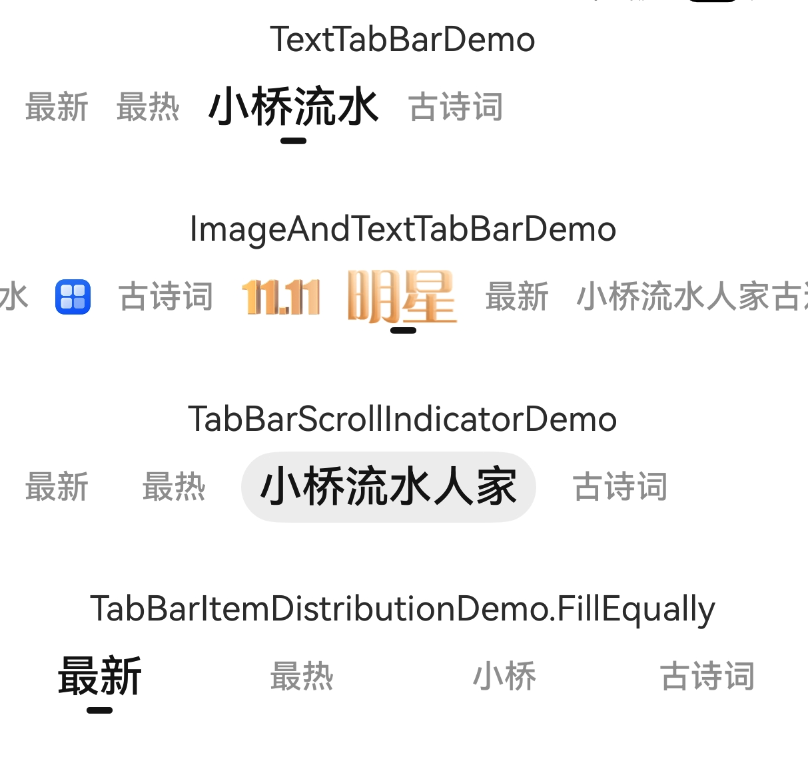

# TabBar for ArkUI

一个灵活、可定制的标签栏组件，适用于频道页、选项切换、与 `Tabs` 联动等场景。

---

## ✨ 特性

- ✅ `TabBarItem`自定义布局
- ✅ 支持多种排列分布策略：等宽、等间距、自适应宽度
- ✅ 可配置 `ScrollIndicator` 滚动指示条（颜色、高度、对齐方式等）
- ✅ 支持与 ArkTS 原生 `Tabs` 组件联动

---

## 🖼️ 示例效果图



---

## 📦 安装
```shell
ohpm i @sj/tabbar
```

---

## 🔧 引用方式

请在需要依赖的模块找到 oh-package.json5 文件, 新增如下依赖, 执行同步后等待安装完成;
```json
{
  "dependencies": {
    "@sj/tabbar": "^1.0.4"
  }
}
```

---

## 🚀 快速上手

```ts
import { TabBar, TabBarItem, TabBarState } from '@sj/tabbar';

@ComponentV2
struct TextTabBarDemo {
  @Local private mTabBarItems: TabBarItem[] = [
    new TextTabBarItem('最新'),
    new TextTabBarItem('最热'),
  ];
  @Local private mCurrentIndex: number = 1; // 可以设置默认索引位置;

  build() {
    TabBar({
      items: this.mTabBarItems,
      itemBuilder: TabBarItemBuilder,   // 这里传入 item 自定义的 Builder;
      currentIndex: this.mCurrentIndex,
      onItemClick: (index) => {
        this.mCurrentIndex = index;     // item 点击回调
      }
    })
  }
}

/// 自定义 item 数据类
class TextTabBarItem {
  text: string;

  constructor(text: string) {
    this.text = text;
  }
}

/// 自定义 item 布局
@Builder
function TabBarItemBuilder(index: number, item: TabBarItem, state: TabBarState) {
  /// 在这里根据 item 的具体类型创建布局
  /// 参数 state 中含有当前选中的 item 的索引, 通过与 index 进行比较, 可以确定是否是`选中状态`;

  if ( item instanceof TextTabBarItem ) {
    /// 这里对字体大小和字体颜色做了动态改变, 并且添加了属性动画;
    Text(item.text)
      .height(25)
      .textAlign(TextAlign.Center)
      .fontSize(state.currentIndex === index ? 20 : 15) // state.currentIndex 是当前选中的 item 的索引, 这里设置选中时字体大小为20, 未选中时字体大小为15;
      .fontWeight(FontWeight.Medium)
      .fontColor(state.currentIndex === index ? 0x121212 : 0x989898)
      .animation({ curve: 'linear', duration: 150 })
  }
}
```

## 🔄 与 Tabs 联动

```ts
import { TabBar, TabBarItem, TabBarState, TabBarSwipeController } from '@sj/tabbar';

@ComponentV2
struct TabsInteractionDemo {
  @Local private mTabs: TabViewModel[] = [
    new TabViewModel("最新", "#00FF00"),
    new TabViewModel("最热", "#00FFFF"),
    new TabViewModel("小桥流水", "#FFFF00"),
    new TabViewModel("古诗词", "#00FF0F"),
    new TabViewModel("这是一条震古烁今的文本", "#0FF000")
  ];

  private mInitialIndex = 2; // Tabs的初始索引; 可以设置默认索引位置, 这里修改为 2;
  @Local private mCurrentIndex: number = 2; // 可以设置默认索引位置, 这里修改为 2;

  private mTabsController: TabsController = new TabsController();
  private mTabsWidth: number = 0; // 记录 tabs 的宽度, TabBarSwipeController 需要;

  private mTabBarSwipeController = new TabBarSwipeController(); // 用于传递 tabs 的滑动事件; 实现指示条同步滑动及 item 的缩放控制;

  build() {
    Column() {
      TabBar({
        items: this.mTabs,
        currentIndex: this.mCurrentIndex,
        itemBuilder: TabBarItemBuilder2, // 传递 TabBarItemBuilder2, 用于构建自定义的 item 布局;
        swipeController: this.mTabBarSwipeController, // 传递 mTabBarSwipeController, 实现指示条同步滑动及 item 的缩放控制;
        onItemClick: (index) => {
          this.mCurrentIndex = index;
          this.mTabsController.changeIndex(index);
        }
      })

      Tabs({
        barPosition: BarPosition.Start,
        index: this.mInitialIndex,
        controller: this.mTabsController,
      }){
        ForEach(this.mTabs, (item: TabViewModel) => {
          TabContent()
          .backgroundColor(item.pageBackgroundColor)
          .width('100%')
          .height('100%')
        })
      }
      .vertical(false)
      .barHeight(0)
      .width('100%')
      .layoutWeight(1)
      .onAreaChange((_, newArea) => {
        this.mTabsWidth = newArea.width as number; // 记录 tabs 的布局宽度; TabBarSwipeController 需要;
      })
      .onAnimationStart((index, targetIndex, event) => {
        this.mCurrentIndex = targetIndex
        this.mTabBarSwipeController.animationStart(index, targetIndex, event, this.mTabsWidth); // 传递 tabs 滑动事件
      })
      .onAnimationEnd((index, event) => {
        this.mTabBarSwipeController.animationEnd(index, event, this.mTabsWidth); // 传递 tabs 滑动事件
      })
      .onGestureSwipe((index, event) => {
        this.mTabBarSwipeController.swipe(index, event, this.mTabsWidth); // 传递 tabs 滑动事件
      })
    }
    .backgroundColor(0xFFFFFF)
    .width('100%')
    .height('100%')
  }
}

class TabViewModel {
  readonly title: string;
  readonly pageBackgroundColor: string;

  constructor(title: string, pageBackgroundColor: string) {
    this.title = title;
    this.pageBackgroundColor = pageBackgroundColor;
  }
}

@Builder
function TabBarItemBuilder2(index: number, item: TabBarItem, state: TabBarState) {
  if ( item instanceof TabViewModel ) {
    Text(item.title)
      .height(25)
      .textAlign(TextAlign.Center)
      .fontSize(15 + (20 - 15) * state.getItemScaleFactor(index)) // 这里获取缩放因子: 当前尺寸 = 基础尺寸 + (最大尺寸 - 基础尺寸) * scaleFactor; 缩放因子是由 TabBarSwipeController 传递的滑动事件计算得出;
      .fontWeight(FontWeight.Medium)
      .fontColor(state.currentIndex === index ? 0x121212 : 0x989898)
      .animation(!state.isSwiping ? { duration: 150.0, curve: Curve.Linear } : undefined) // 这里有个细节就是当进行 tabs 的滑动交互(state.isSwiping)时不开启动画, 其他时候启用属性动画;
  }
}
```
